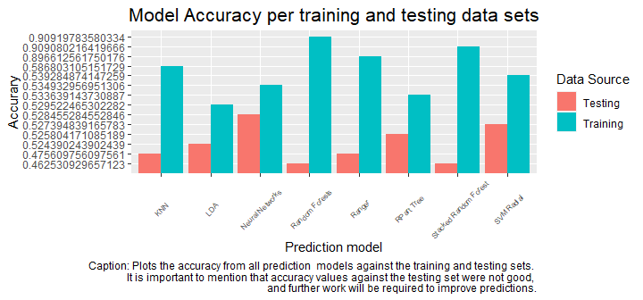

<style type="text/css">
body, td {
   font-size: 8px;
}
code.r{
  font-size: 13px;
}
pre {
  font-size: 13px
}
</style>

## Summary

This presentation describes the process of developing several ML models to predict 
the result (HOME WINS/DRAW/AWAY WINS) of football matches using the odds published by 2
of the most famous betting sites: Bet 365 and Blue Square. Below is the code to 
decompress and preprocess the data used to train the different models, which was downloaded from:
https://www.kaggle.com/caesarlupum/betsstrategy


```r
unzip('europeansoccerdatabase.zip')
football = read.csv('FootballDataEurope.csv')
football = football[complete.cases(football[, c('country_name', 'league_name', 'home_team', 
        'away_team','B365H', 'B365D', 'B365A', 'BSH', 'BSD', 'BSA', 'diff_goals')]),]
football$result = football$diff_goals
football$result[football$result > 0] = 'home wins'
football$result[football$result < 0] = 'away wins'
football$result[football$result == 0] = 'draw'
football$result = as.factor(football$result)
football$diff_goals = as.factor(football$diff_goals)
```

## Training and testing data partitioning

The below code was used to partition the downloaded data set into training and testing sets of
0.6 and 0.4 complete observations respectively:


```r
set.seed(100)
modTrainingPartition = createDataPartition(y = football$diff_goals, p = 0.6, list = FALSE)
fbmodeltraining = football[modTrainingPartition, ]
fbmodeltesting = football[-modTrainingPartition, ]
data = fbmodeltraining[, !names(fbmodeltraining) %in% c('diff_goals', 'country_name',
                        'league_name', 'home_team', 'away_team')]
football = football[, c('country_name', 'league_name', 'home_team', 'away_team','B365H', 
                        'B365D', 'B365A', 'BSH', 'BSD', 'BSA', 'diff_goals')]
fitControl <- trainControl(method = "repeatedcv", number = 5, repeats = 3, 
        allowParallel = TRUE)
```

## Prediction models

The following 7 prediction models were built using the caret package (code is not being evaluated as it is tremendously time consuming, but it can be used for reproducibility purposes):


```r
fitTreeResult = train(result ~ ., data = data, method = 'rpart', trControl = fitControl)
fitRFResult = train(result ~ ., data = data, method = 'rf', trControl = fitControl)
fitNNResult = train(result ~ ., data = data, method = 'nnet', trControl = fitControl)
fitLDAResult = train(result ~ ., data = data, method = 'lda', trControl = fitControl)
fitRangeresult = train(result ~ ., data = data, method = 'ranger', trControl = fitControl)
fitKNNResult = train(result ~ ., data = data, method = 'knn', trControl = fitControl)
fitSVMRadialesult = train(result ~ ., data = data, method = 'svmRadial', trControl = fitControl)
```


And, with their respective predictions, a stacked random forest model was also developed:


```r
fitRFStackedResult = train(result ~ ., data = stackedTrainingPredictions, method = 'rf', trControl = fitControl)
```

## Accuracy Results


For additional information regarding the code, please refer to 
code files in https://github.com/sgomezgomez/DevelopingDataProducts_FinalAssignment.

<!-- -->

